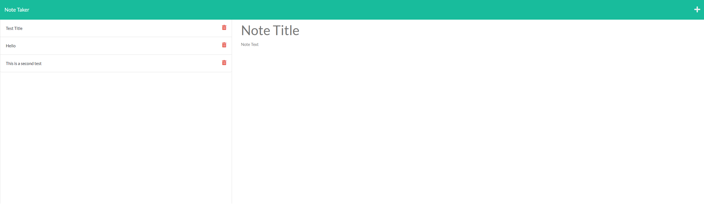

# Note Taker

## Description

The motivation and purpose behind this project was to fix an error with an already existing note taker app. It was missing the backend development so one had to be made. I learned a lot about linking front end development to back end development. I also learned the importance of putting the wildcard route at the bottom of the page.

## Table of Contents

- [Installation](#installation)
- [Usage](#usage)
- [Credits](#credits)
- [License](#license)

## Installation

Node must be installed

## Usage

Heroku deployment: https://secret-retreat-77742.herokuapp.com/

 

## Credits

[Node](https://nodejs.org/en/)

## License

MIT License

A short and simple permissive license with conditions only requiring preservation of copyright and license notices. Licensed works, modifications, and larger works may be distributed under different terms and without source code.